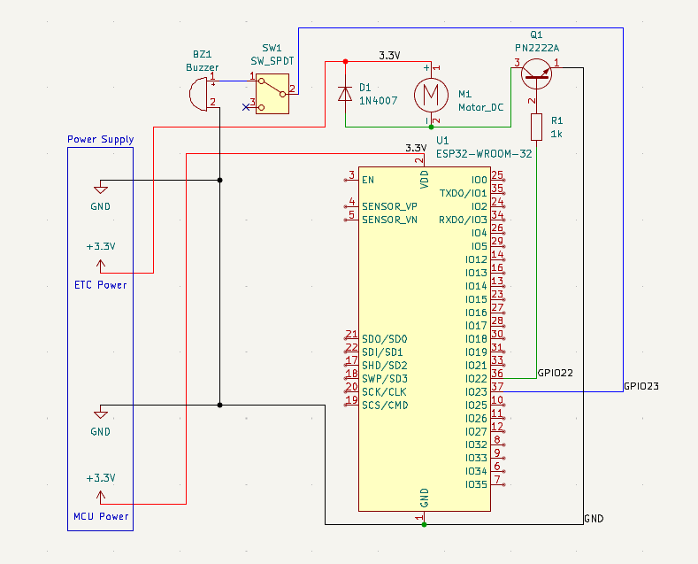
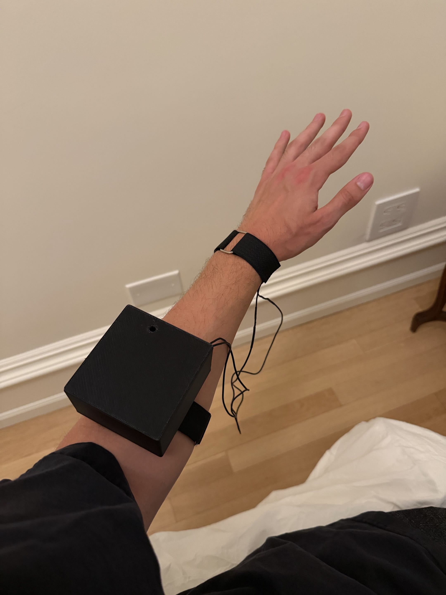
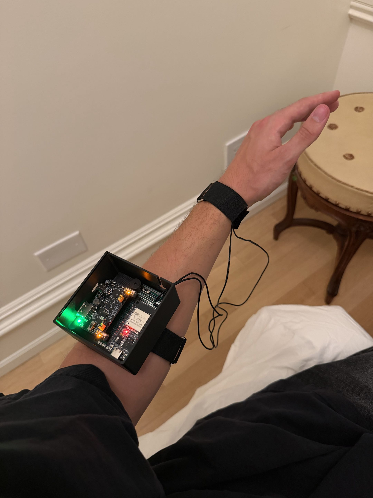
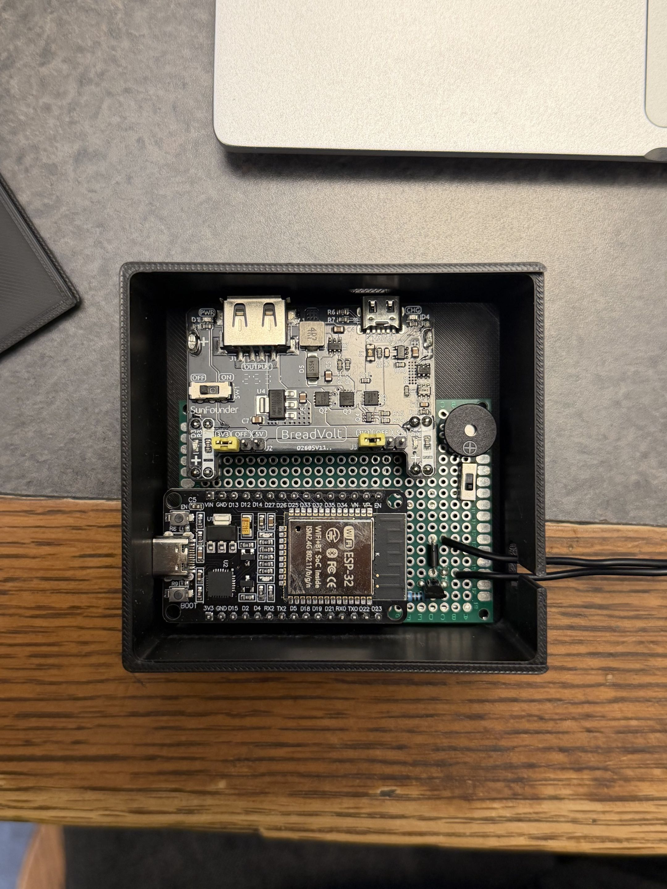

# Wearable Alarm Clock

A wrist-worn alarm that wakes a user with simultaneous haptic and auditory feedback, powered by an ESP32 and a coin motor.

## Hardware
* DOIT ESP32 Devkit V1
* Sunfounder Breadvolt Power Supply 5V/3.3V, 500mAh rechargeable battery
* Passive buzzer
* Coin motor, 1N4007, PN2222, 1kΩ resistor
* Perfboard

## Schematic

  

## Photos

  
  

  

## Workflow
1. A user activates the device with the power supply switch.
2. The alarm advertises in Bluetooth Low Energy (BLE).
3. A user connects to the device with a BLE app such as LightBlue.
4. A user enters the current time as a string in the format "TIME: YYYY-MM-DD hh:mm:ss".
5. They then enter the desired alarm time as a string in the format "TIME: YYYY-MM-DD hh:mm:ss".
6. The ESP32 calculates the difference between the alarm and current time, then enters deep sleep mode for this long.
7. Upon wake-up, the alarm sequence activates, simultaneously vibrating the motor and beeping in long pulses then quick chirps.
8. The alarm is disabled by turning the power supply off.
9. The sequence is reset, and a new alarm may be set upon device reactivation.

## Power
The device uses a 500mAh battery and has an approximate battery life of 50 hours. Deep sleep mode is used to conserve power.

## Software
The ESP32 firmware is written in C++ within the Arduino framework. The source code is included in this repository as "wearable_alarm_flash.ino".
The software handles:
* BLE Communication with the cell phone
* Parsing of the current and alarm time
* Alarm time calculation
* Power management through deep sleep mode
* Synchronized motor and buzzer control

## Future Improvements
1. The power supply module and ESP32 Devkit are intended for breadboarding and could be reduced in size to improve the user experience.
2. The aforementioned components have permanently enabled LEDs that consume a combined 5.5 mA, measured experimentally. Desoldering these LEDs is a minimally invasive way to substantially improve power efficiency.
3. The aforementioned components are otherwise inefficient, as they have hardware unrelated to the alarm that consumes power, so replacing them with more targeted hardware would also improve power efficiency.
4. Creating an app for the alarm would remove the need for the user to input the current time and require less strict formatting for the alarm time.
